# Cyclistic Bike-Share Analysis
This case study is a Capstone Project for the Google Data Analytics Certificate.  
## Scenario
Cyclistic is a bike-share company based in Chicago. The director of marketing believes the company’s future success depends on maximizing the number of annual memberships. Therefore, the marketing analytics team wants to understand how casual riders and annual members use Cyclistic bikes differently. From these insights, the team will design a new marketing strategy to convert casual riders into annual members. But first, Cyclistic executives must approve the recommendations, so they must be backed up with compelling data insights and professional data visualizations.
## Ask
### Stakeholders
1. Lily Moreno - The director of marketing. Moreno is responsible for the development of campaigns and initiatives to promote the bike-share program. These may include email, social media, and other channels.
2. Cyclistic Executive Team - The notoriously detail-oriented executive team will decide whether to approve the recommended marketing program.
### Business Task
Analyze the data to identify an appropriate strategy to influence casual riders to purchase annual memberships.
### Questions
1. How do annual members and casual riders use Cyclistic bikes differently?
2. Why would casual riders buy Cyclistic annual memberships?
3. How can Cyclistic use digital media to influence casual riders to become members?
## Prepare
### Data Source
For the purposes of this study, I will be using data made available by Motivate International Inc. under this [license](https://divvybikes.com/data-license-agreement). I used data from the past [12 months](https://divvy-tripdata.s3.amazonaws.com/index.html), March 2023 to February 2024.
### Limitations
Data-privacy issues prohibit the use of riders’ personally identifiable information.
### Data Documentation
Read more at the [Data Documentation File](/Data-Documentation.md)
## Process
### Applications
I used Microsoft Excel to first explore the data and do some initial cleaning. For further analysis and manipulation, I used pgAdmin and PostgreSQL. This was also what I used to make a database. For the visualizations and dashboard, I used Power BI.
### Cleaning and Manipulation
1. Excel
   * Removed latitude and longitude data as I did not see the need for them in this analysis.
   * Removed some blank and null values for the first few files then continued in SQL as some files took too long to process in Excel.
   * Added a column named ```ride_duration```, which is ```ended_at - started_at``` to get the duration of the trip. From that I encountered issues with the format and found out that some start times and end times were switched. This issue was fixed after switching them back.
   * Removed durations that were 00:00:00.
   * Converted files to .csv to import into a database.
2. SQL
   * Created a database and imported .csv files.
   * Removed rows with blank and null values.
   * Removed ride durations that were less than 1 minute and more than 24 hours to make sure the data was significant.
   * Extracted the ```day_of_week``` from the ```started_at``` date. Values were from 0-6, 0 = Sunday until 6 = Saturday.
   * Calculated the total minutes from the ```ride_duration```.
   * Removed station information as I did not use them for analysis and it also helped with loading time.
   * Exported a .csv file for visualization after getting summary statistics.    
All SQL code can be located [here](/Cyclistic_UpdatedTable_Queries.sql).
## Analyze
### Summary Statistics
1. Average Ride Durations
   ```
   --Average Duration for all Rides--
   SELECT AVG(ride_duration)
   FROM trip_data_updated;

   --Average Duration per Membership Type--
   SELECT member_casual, AVG(ride_duration)
   FROM trip_data_updated
   GROUP BY member_casual;

   --Average Duration per Day--
   SELECT EXTRACT(DOW FROM started_at) AS day_of_week, AVG(ride_duration)
   FROM trip_data_updated
   GROUP BY day_of_week
   ORDER BY day_of_week;
   ```
   <p align="center">
     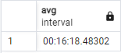
   </p>
   <p align="center">
     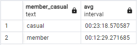
   </p> 
    The average ride duration for all rides is 16:18.4830 minutes. Casual riders taking longer at 23:18.5706 minutes compared to annual members at 12:29.2717 minutes.  
   <p align="center">
     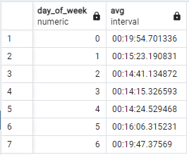
   </p>  
    Sundays and Saturdays have longer ride durations on average at 19:54.7013 minutes and 19:47.3757 minutes respectively.
  
3. Number of Rides
   ```
   --Total Number of Rides--
   SELECT COUNT(ride_id)
   FROM trip_data_updated;

   --Count per Day of Week--
   SELECT EXTRACT(DOW FROM started_at) AS day_of_week, COUNT(ride_id)
   FROM trip_data_updated
   GROUP BY day_of_week
   ORDER BY day_of_week;

   --Count per Membership Type--
   SELECT member_casual, COUNT(ride_id)
   FROM trip_data_updated
   GROUP BY member_casual;
   ```
   <p align="center">
     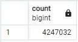
   </p>
   <p align="center">
     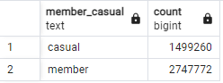
   </p> 
   Based on the data, there are more rides from annual members than casual riders.  
   <p align="center">
     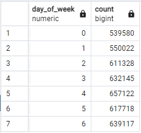
   </p>  
   Ride numbers peak in the middle of the week on Thursday, with the lowest number of rides being on Sunday.
   
### Visualizations
  <p align="center">
    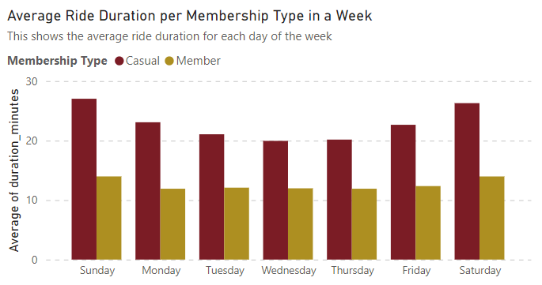
  </p>
  This visualization clearly shows that, on average, casual riders use bikes longer than annual members, with casual riders riding the most on weekends. It can be inferred that casual riders use bikes mainly for leisure.
  <p align="center">
    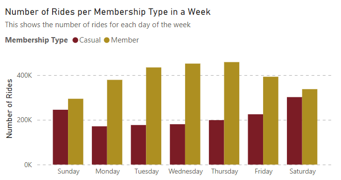
  </p>
  This visualization shows that annual members take more rides compared to casual riders. Most annual members ride a lot on weekdays, so it can be inferred that they use bikes to commute.
  <p align="center">
    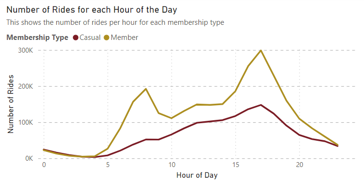
  </p>
  This visualization takes a closer look on how bikes are used throughout the day. From this, we can see that annual members ride bikes mainly around 8 AM and 5 PM. This adds to the idea that they use bikes mainly for commuting. On the other hand, casual riders tend to ride bikes around late afternoons until early evenings.
  <p align="center">
    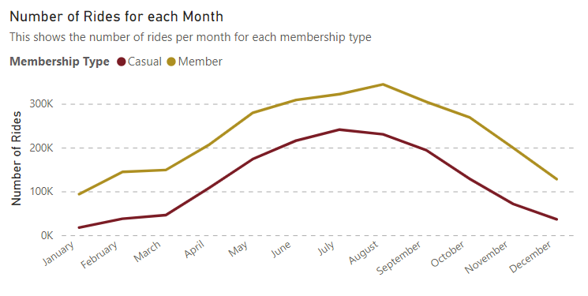
  </p>
  This visualization can help us see how users ride bikes throughout the year. The trend is similar between both membership types where it shows peak usage around June, July, and August, and a downward trend around November, December, and January. This is most likely related to seasonal changes.
  
## Share
Cyclistic Bike-Share Analysis Dashboard
<p align="center">
  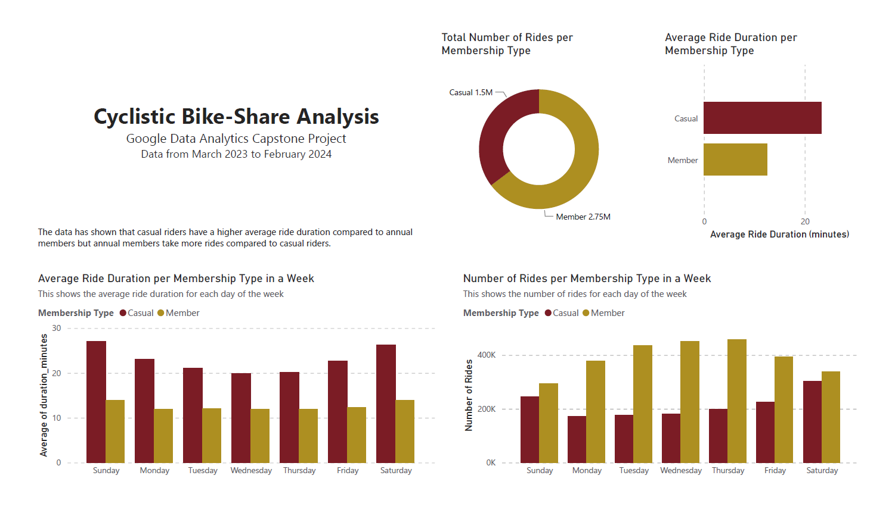
</p>
<p align="center">
  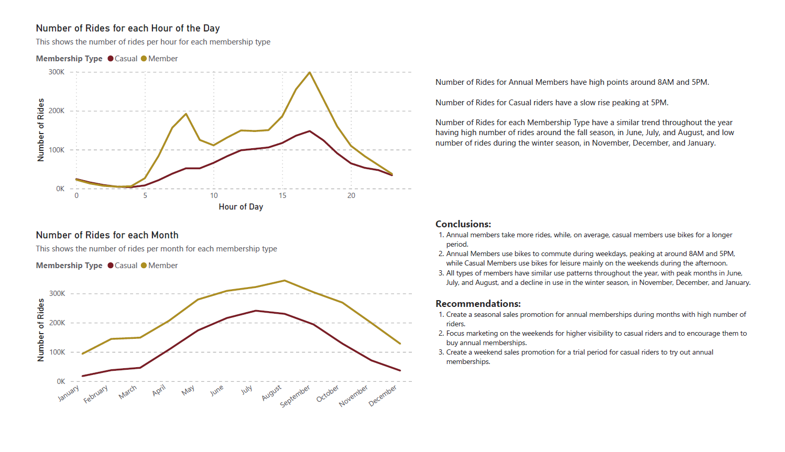
</p>

## Act
### Conclusions
1. Annual members take more rides, while, on average, casual members use bikes for a longer period.
2. Annual Members use bikes to commute during weekdays, peaking at around 8AM and 5PM, while Casual Members use bikes for leisure mainly on the weekends during the afternoon.
3. All types of members have similar use patterns throughout the year, with peak months in June, July, and August, and a decline in use in the winter season, in November, December, and January.
### Recommendations
1. Create a seasonal sales promotion for annual memberships during months with high number of riders.
2. Focus marketing on the weekends for higher visibility to casual riders and to encourage them to buy annual memberships.
3. Create a weekend sales promotion for a trial period for casual riders to try out annual memberships.
